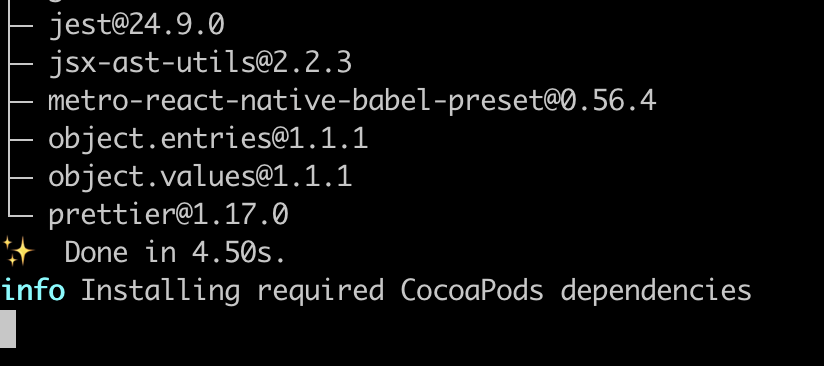
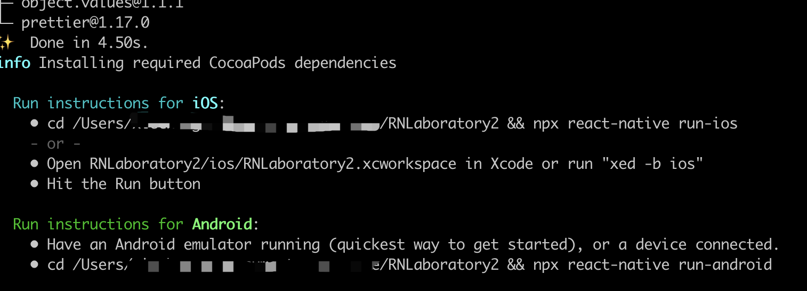
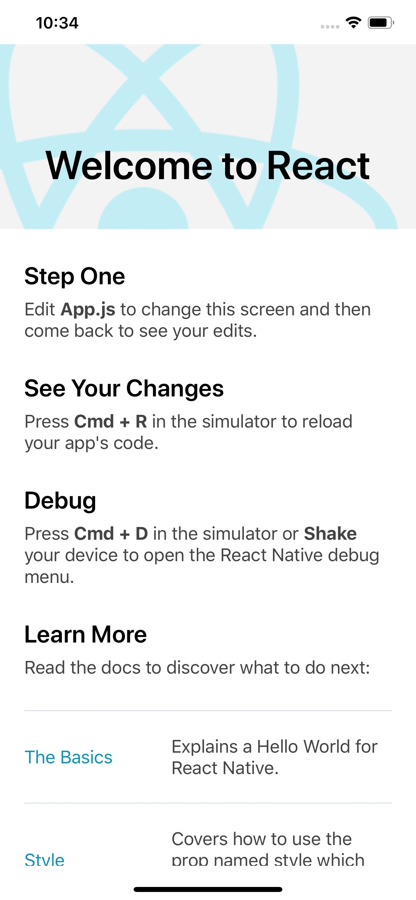
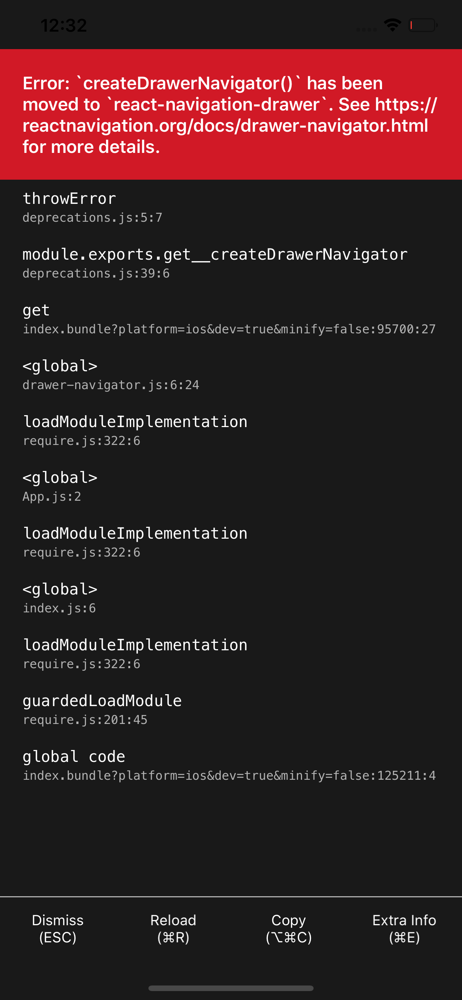
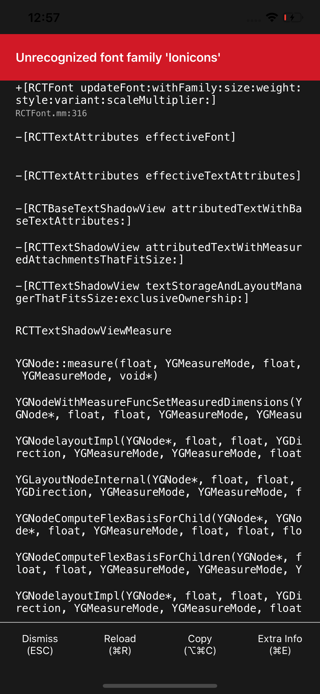
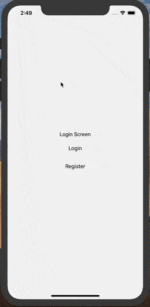

# React Native 实验室 - 项目初始化

## 引言
<u>[github传送门](https://github.com/iChengbo/react-native-laboratory)</u>


本文主要介绍以下几部分。

- 初始化
- 路由跳转

## 一、初始化 React Native 项目
### RN 基础环境配置

<u>[React Native 中文网之搭建开发环境](https://reactnative.cn/docs/getting-started/)</u>

项目初始化可以参考官方文档，写的比较详细。其中，项目新建可以归纳为以下步骤：
#### init
```
npx react-native init RNLaboratory
```

#### run
```
cd RNLaboratory
react-native run-ios
```

#### 注意：

1. 安装 CocoaPods

由于 RN 0.60+ 版本依赖 CocoaPods，但是国内难以访问此仓库。所以，在执行 `npx react-native init RNLaboratory` 进行初始化项目时会卡在 **info Installing required CocoaPods dependencies**，如下图所示：



此时可以安装国内镜像，<u>[参考文档](https://mirror.tuna.tsinghua.edu.cn/help/CocoaPods/)</u>。若实现安装好此镜像，当执行 `npx react-native init RNLaboratory` 时，会发现初始化项目很快，如图所示：



2. 若在 **xcode** 直接运行应用时应选择 **.xcworkspace** 文件，而不是 **.xcodeproj** 文件。

当以上步骤顺利完成后，使用命令 `react-native run-ios` 启动 `APP`，如下所示：
<div align=center>
    
</div>

## 二、导航库

### 1. 选择一个合适的导航库

在使用React Native开发移动应用程序时，最重要的步骤之一就是选择合适的导航库。一般来说，有以下两种选择方案：

- <u>[react-navigation 官方文档](https://reactnavigation.org/en/)</u>

- <u>[react-native-navigation 官方文档](https://wix.github.io/react-native-navigation/#/)</u>


在项目 <u>**[React Native 实验室](https://github.com/iChengbo/react-native-laboratory)**</u> 中选择了 `react-navigation` 作为导航库，在此不做详细对比，有兴趣的同学可以参考以下链接：

- <u>[React Navigation vs. React Native Navigation: Which is right for you?](https://blog.logrocket.com/react-navigation-vs-react-native-navigation-which-is-right-for-you-3d47c1cd1d63/)</u>

- <u>[React导航的主要贡献者Brent Vatne的精彩演讲](https://www.youtube.com/watch?v=GBhdooVxX6Q)</u>

- <u>[](https://www.youtube.com/watch?v=wJJZ9Od8MjM)</u>


### 2. 安装及配置

#### 安装

1. 安装 `react-navigation`
```
yarn add react-navigation
# or with npm
# npm install react-navigation
```
2. 安装 `react-navigation` 相关依赖

```
yarn add react-native-reanimated react-native-gesture-handler react-native-screens react-native-safe-area-context
```

#### IOS 配置
```
cd ios
pod install
cd ..
```

#### Android 配置

1. 修改`android/app/build.gradle`, 在该文件 `dependencies` 中添加如下两行代码：

```java
implementation 'androidx.appcompat:appcompat:1.1.0-rc01'
implementation 'androidx.swiperefreshlayout:swiperefreshlayout:1.1.0-alpha02'
```

2.   修改 `android/app/src/main/java/com/APP_NAME/MainActicity.java`，如下所示：
```diff
package com.reactnavigation.example;

import com.facebook.react.ReactActivity;
+ import com.facebook.react.ReactActivityDelegate;
+ import com.facebook.react.ReactRootView;
+ import com.swmansion.gesturehandler.react.RNGestureHandlerEnabledRootView;

public class MainActivity extends ReactActivity {

  @Override
  protected String getMainComponentName() {
    return "Example";
  }

+  @Override
+  protected ReactActivityDelegate createReactActivityDelegate() {
+    return new ReactActivityDelegate(this, getMainComponentName()) {
+      @Override
+      protected ReactRootView createRootView() {
+        return new RNGestureHandlerEnabledRootView(MainActivity.this);
+      }
+    };
+  }
}
```

#### 注意：

1. 若使用导航器 `createStackNavigator` ，则需安装以下依赖：
```
yarn add react-navigation-stack @react-native-community/masked-view
```


### 3. react-navigation 简介

> **react-navigation** 提供了简单易用的跨平台导航方案，在 iOS 和 Android 上都可以进行翻页式、tab 选项卡式和抽屉式的导航布局。其提供以下7个API用于实现不同的导航方式，以下简单说明各自效果。（此处不做过多介绍，毕竟<u>[官方网站](https://reactnavigation.org/en/)</u>写的还算不错...😁😁😁）

- createStackNavigator
    > 基础
- createSwitchNavigator
    > 介绍
- createAnimatedSwitchNavigator
    > 介绍
- createDrawerNavigator
    > 介绍
- createBottomTabNavigator
    > 介绍
- createMaterialBottomTabNavigator
    > 介绍
- createMaterialTopTabNavigator
    > 介绍

注意：

1. 若运行时报以下错误，可根据提示知相应的API已由 `react-navigation` 移至相应的库，需安装相应的依赖。

    <div align=center>
        
    </div>

1. 若引入 `react-native-vector-icons` 时出现以下错误，可参考 <u>[How to use vector icons in your react-native project](https://medium.com/@vimniky/how-to-use-vector-icons-in-your-react-native-project-8212ac6a8f06)</u> 解决。

    <div align=center>
        
    </div>


在项目 <u>**[React Native 实验室](https://github.com/iChengbo/react-native-laboratory)**</u> 中基于 xxx、xxx... 实现了基础路由跳转功能。效果图如下：

<div align=center>
    
</div>


## 后话


